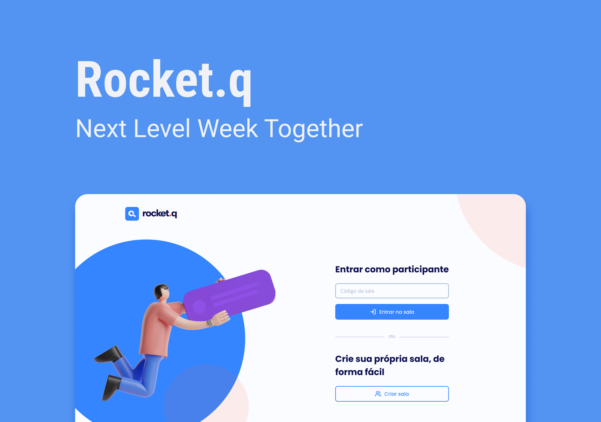

# Rocket.q

  

## 🚀 Tecnologias
Esse projeto foi desenvolvido com as seguintes tecnologias:
- HTML
- CSS
- JavaScript

##  NodeJS
- [NodeJS](https://nodejs.org/en/)
- [EJS](https://ejs.co)
- [Express](https://www.npmjs.com/package/express)
- [SQLite](https://www.npmjs.com/package/sqlite)
- [Nodemon](https://www.npmjs.com/package/nodemon) (Dependência DEV)

**Não esqueça de instalar as dependências acima**

## 💻 Projeto
O Rocket.Q é uma aplicação de interação através de perguntas, sendo possível criar uma sala para internautas anônimos fazerem perguntas e o criador da sala em posse de uma senha gerenciar essas perguntas e marcar como lidas.

## 📄 Página do Projeto
https://rocketq-anonymous-questions.herokuapp.com

## 🔖 Layout
Você pode visualizar o layout do projeto através [desse link](https://www.figma.com/community/file/1009821158959690135/Roquet.q). É necessário ter conta no [Figma](https://figma.com) para acessá-lo.